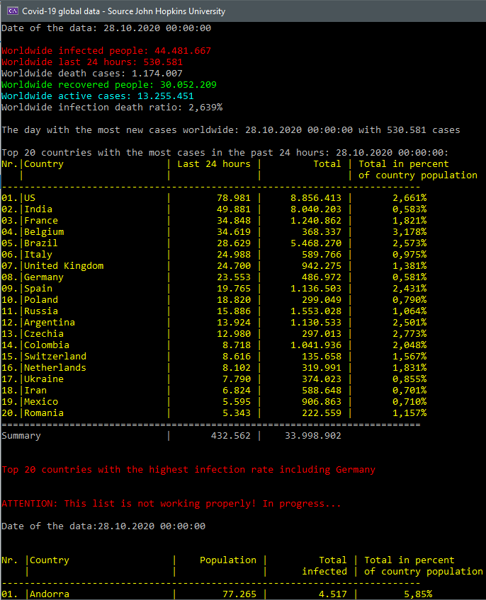

# The Covid-19 Library 

This library analyzes John Hopkins University's
[Covid-19](https://github.com/CSSEGISandData/COVID-19) data and packs it into
.Net compliant objects. So it's a data wrapper.

An example console program is included so that you can understand what the
wrapper provides. While the `Covid19Lib` project is the wrapper library,
the `Covid19LibCLI` is the console application that represents a use of the
`Covid19Lib`.

### Basics

In the project `Covid19Lib` is a file called `settings.cs`. It defines the paths
to John Hopkins University's .csv files.

You don't have to use this file. But when I wrote the sample program, it was
very helpful.

I wrote the paths into this file. However, these are not used in the wrapper.
But these are used in the sample program.

### Further information

The JHU likes to change the structure of the data, which has prevented me
from further analyzing the data and linking them more closely. This does not
mean that I will not do this. But a typical example is the data from the daily
reports. The first reports are pretty easy. The last ones are rather
complicated. However, it is difficult to estimate this development over the
entire period. So I have not considered the daily reports.

However, this can also affect the time series. Another "Population" column 
was recently added to the US death time series. So I had to write two methods, one 
that analyzes the confirmed cases (without Population) and one that analyzes 
the dead.

Very strange...

